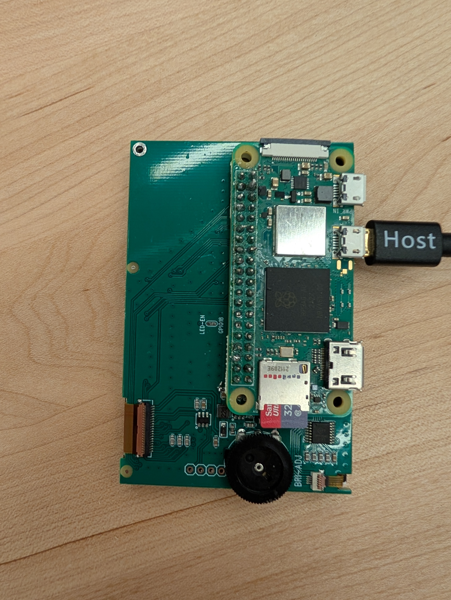
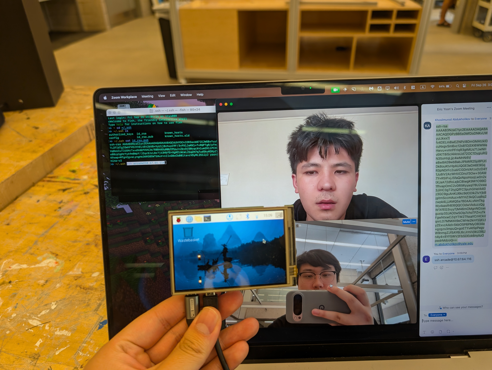
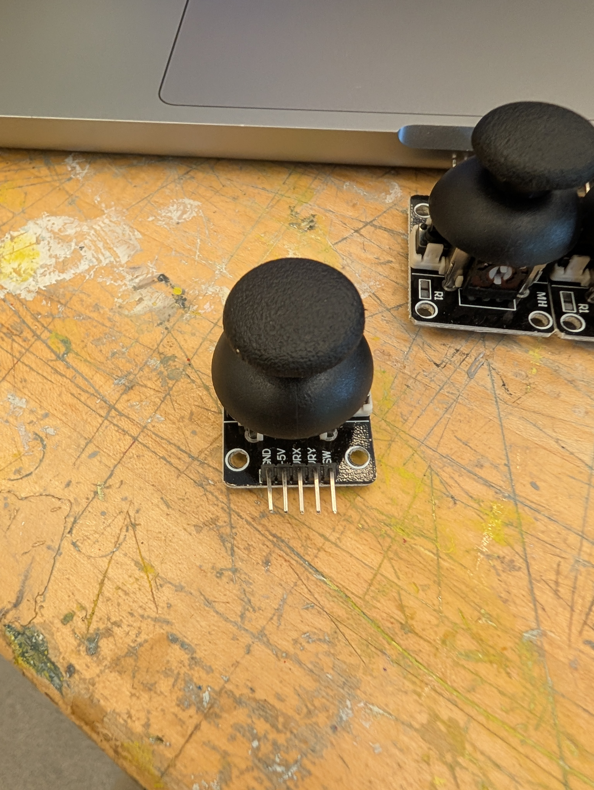
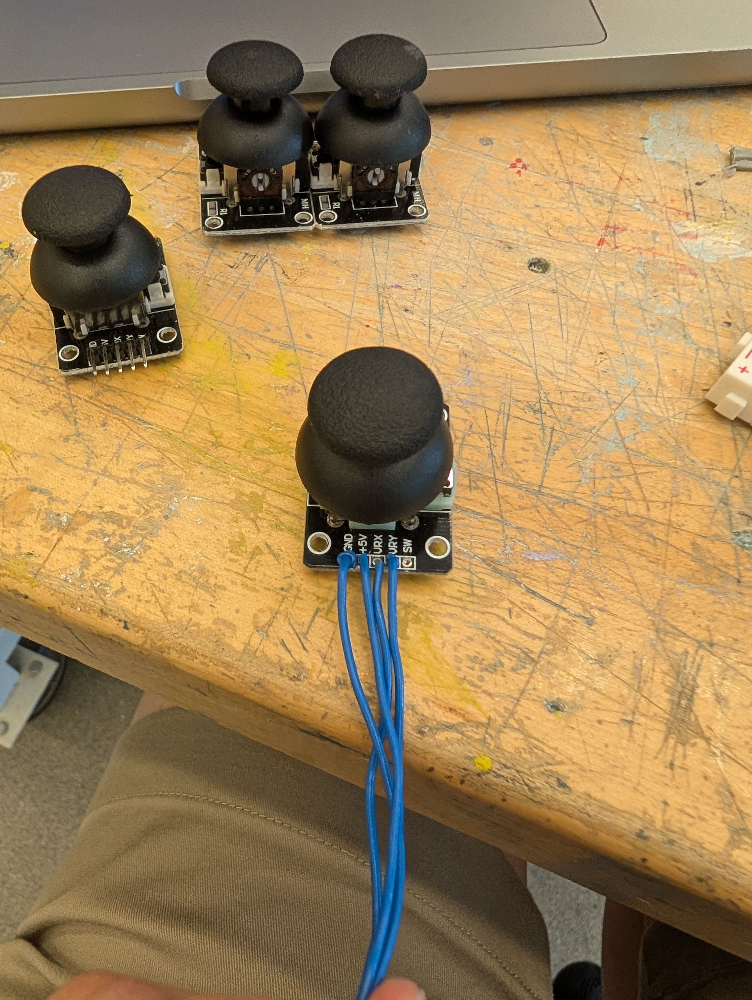
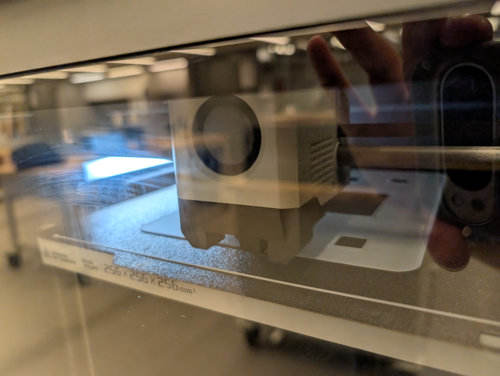

# GameCabinet
Raspberry Pi game cabinet, made for CPSC 3340 Creative Embedded Systems

## Required Materials
- [Raspberry Pi Zero 2 W, headerless](https://a.co/d/8KMoVYZ)
- [ESP-WROOM-32](https://a.co/d/iZ32vMO)
- SD card
- [Small touchscreen for Raspberry Pi Zero](https://a.co/d/8ljvQEd)
- [Short MtM microUSB cable](https://a.co/d/d5F0nlR)
- [Breadboard-layout PCBs](https://a.co/d/15BTbv4)
- [Joystick](https://a.co/d/iXG2HW7) (x2)
- Push button (x2)
- Flip switch (x2)


## Electronics Instructions

### Display

First, you have to solder your RasPi Zero to the small display. Solder all the pins; I found that it's much easier if you create an electrical connection between the pins and the holes before soldering by bending them slightly so they touch the copper rings. This makes it so that both the pins and the holes get heated and the solder can flow between them.





### Joystick
The joysticks you can get on Amazon come pre-installed with MtM headers. We need to remove these.




The best way to do this is to separate the headers by crushing them with some piliers, then applying heat and pulling them out one by one. Note that if you apply heat while pulling with the pliers, the pliers will act as a heat sink, so apply heat *then* apply pliers.

Then, you can solder your own wires to each of the four pins to be used: `GND`, `5V`, `VRY`, and `VRX`. Make sure to use long enough wires.




## 3D Printing Instructions

OnShape CAD available [here](https://cad.onshape.com/documents/6f27eda065649b08f7d7cace/w/1f5f86e878a776f90a9c0eb1/e/d24df1ab04ee5fd927d72df8).

Also see STL files in `/cad`



## Pi Setup Instructions

Follow [this guide](https://www.raspberrypi.com/documentation/computers/getting-started.html) to install boot media onto an SD card for Raspberry Pi Zero.

On the SD card, follow [manufacturer's instructions](https://github.com/iUniker/Pi-Zero-3.5-Inch-Screen/tree/main) to add the drivers to the Pi, so it displays to the screen upon bootup.

At this point, you can boot up the Pi; if you need to register your device on the Yale network you can get the MAC address by doing `ifconfig`.

Once the Pi is connected to the Internet, you can get the IP address, SSH in, and add your SSH key.

You can then clone this repo, set Git to store your credentials, and log in with a Personal Access Token.

I also recommend adding an authorized SSH key.

## Technical Details

Sensor data is sent from the ESP32 to the Raspberry Pi over USB serial. Right now, data is being sent as ASCII (although in the future we could change this to raw binary data).

```
2048/2048/2048/2048/1/1/0/0
```
Where the numbers are delimited by slash (`/`). Each number represents:

1. Player 1 joystick X
2. Player 1 joystick Y
3. Player 2 joystick X
4. Player 2 joystick Y
5. Player 1 button
6. Player 2 button
7. Player 1 switch
8. Player 2 switch
