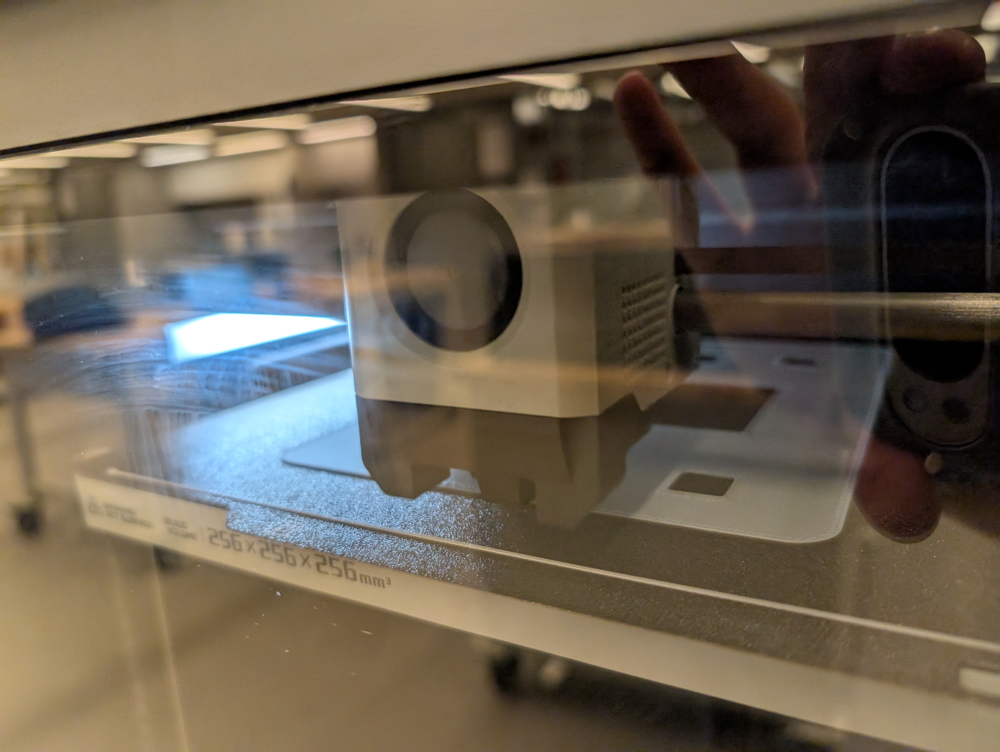
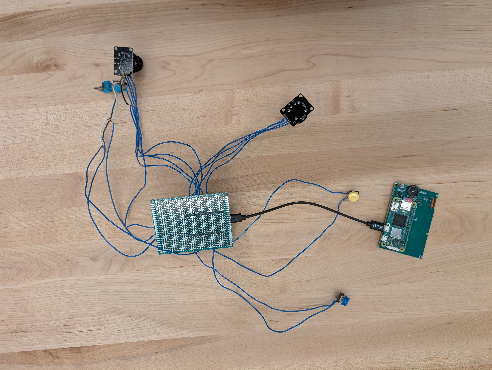
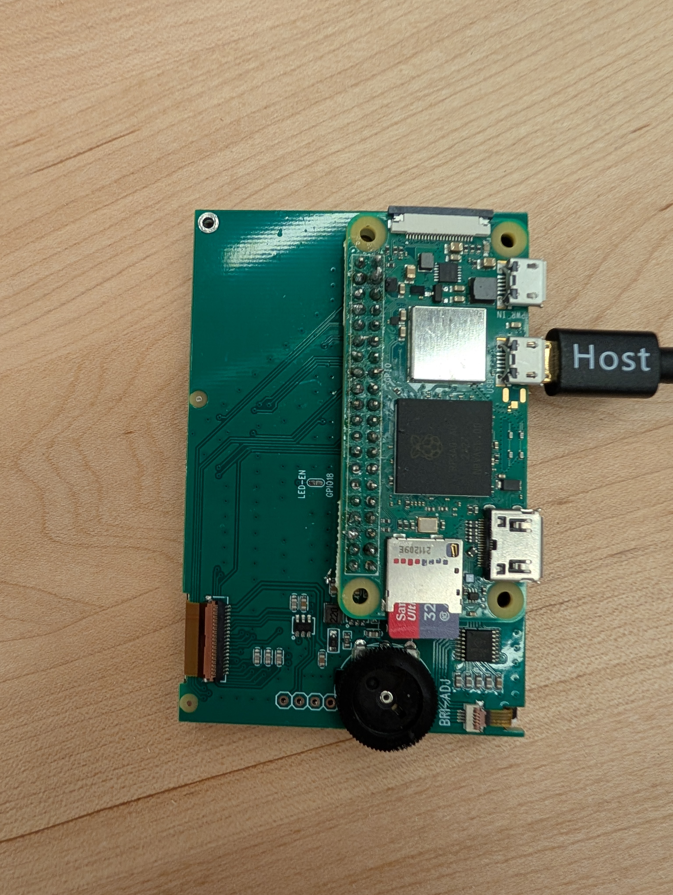
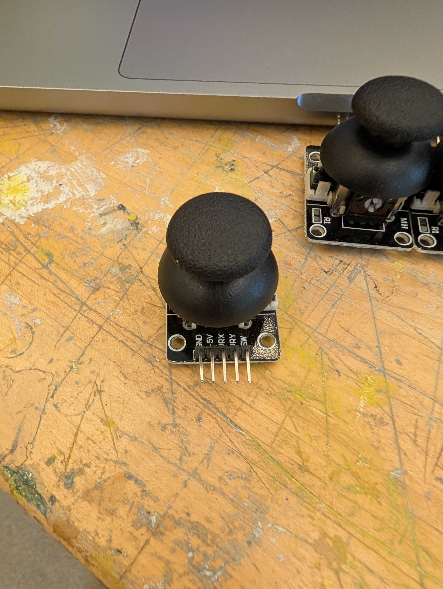
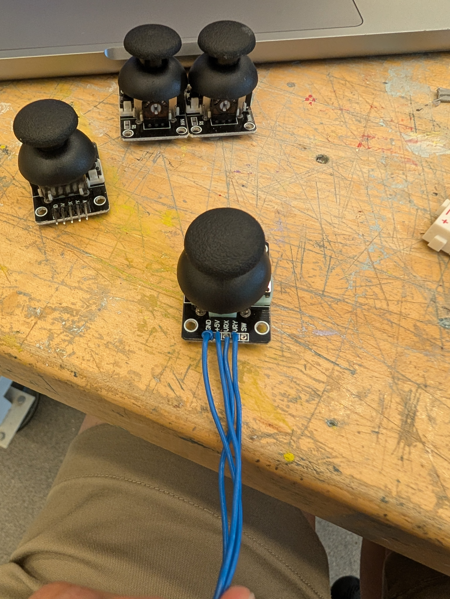
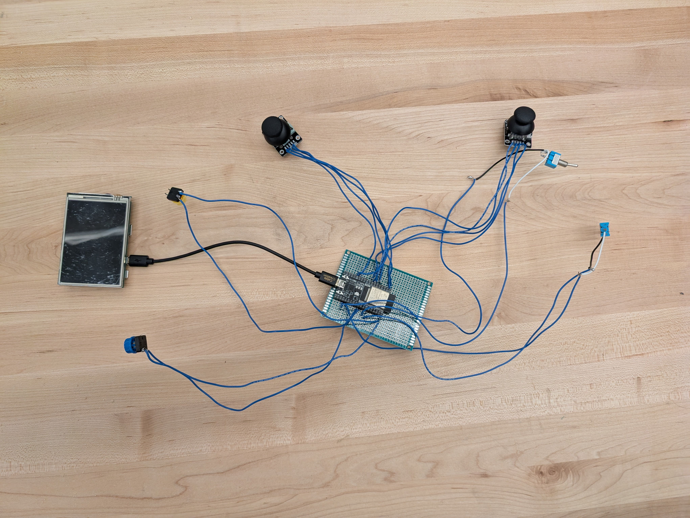
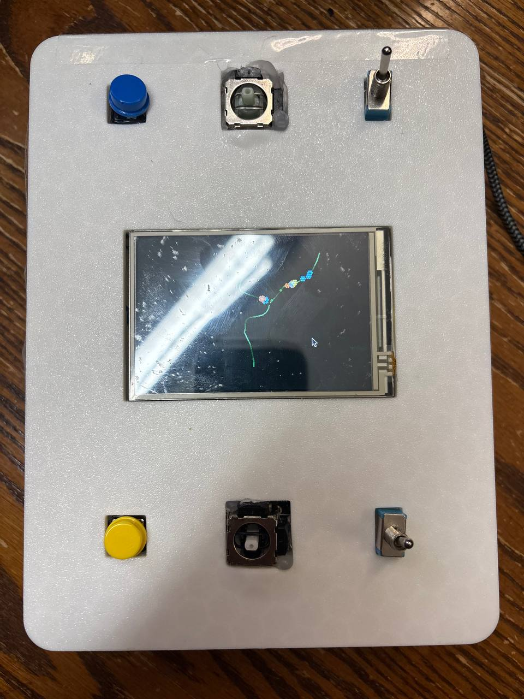
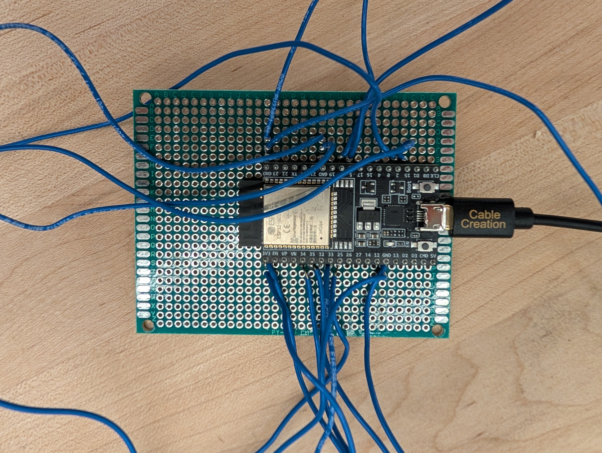
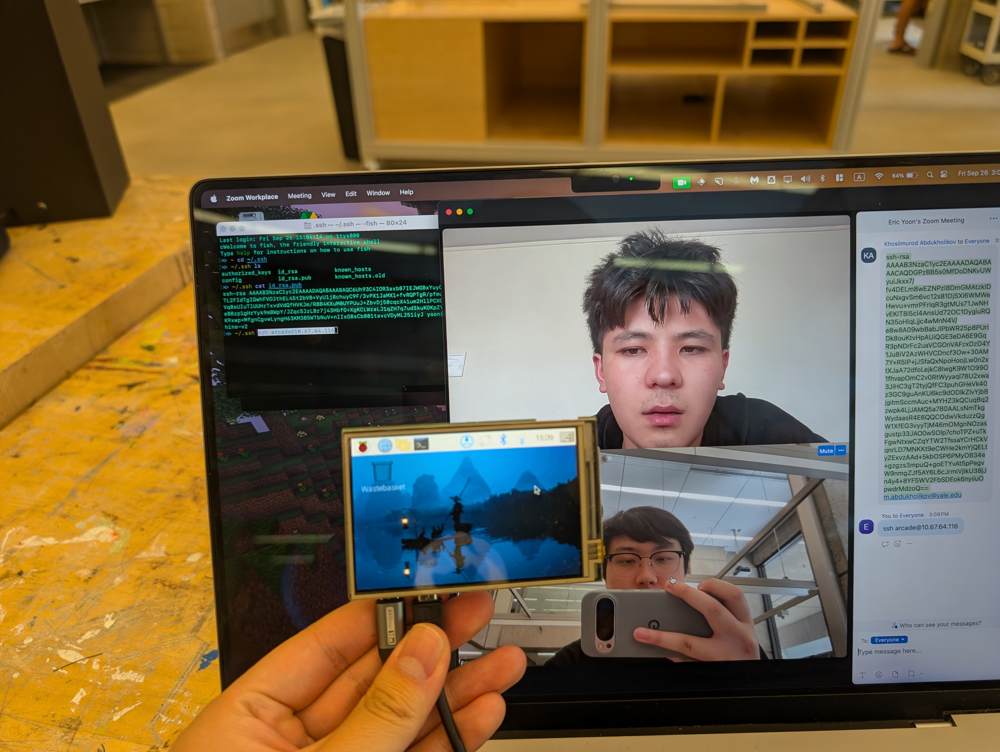

# Game Cabinet

Demos:

[Gravity Game video](./media/space.mp4)

[Plant Growth video](./media/plant.mov)

[Asteroids video](./media/play_together.mov)

## **Creative Vision**

The initial concept was to create generative art pieces inspired by classic arcade games. That’s how we came up with **GameCabinet**, a two-player interactive box that can be used for collaborative art generation and playing games.

Two players sit facing each other with a small central display between them. Each has a joystick, a button, and a toggle switch. When connected via USB, the arcade menu loads and presents three modes: *Asteroids*, a collaborative *Plant Growth* simulation, and a shared *Gravity Planet* environment.

- **Asteroids**: a clone of the classic arcade game, as a proof-of-concept of how the form factor can be used for all sorts of games.
- **Plant Growth:** In this mode, two players collaborate to shape the direction, the buddings, and the flowers in a plant through the controls. Each play session results in a unique creation.
- **Gravity Planet:** Players collaborate to simulate asteroids forming rings around the two planets. Joysticks are used to generate asteroids, while with the buttons, the gravity of the two planets can be adjusted.

---

## **Technical Overview**

For the project, Eric bought a **Raspberry Pi Zero 2 W** and a **mini-screen.** **Raspberry Pi Zero 2 W** serves as the main compute module; while it has less computing power, its small form factor makes it ideal for this project. It connects via USB serial to an **ESP-WROOM-32 microcontroller**, which reads all sensor data from the input hardware and transmits it to the Pi via serial.

### **Hardware Components**

Each player’s control panel includes:

- Analog joystick
- Push button
- Toggle switch

Additional components:

- Pi Zero Display Shield
- ESP32

On the Pi, the application parses data from the inputs and converts them into real-time logic for interaction.

---

## Hardware Details

We decided to solder each component onto a protoboard so the device could handle light impacts (from being carried around in a backpack, lightly battered when one player rage-quits, etc). Some steps in the process of fabricating the electronics:

1. Every pin on the RasPi Zero W was soldered directly onto the pins of the mini display.
2. Pre-installed male headers were removed from the joysticks, and wires were soldered on.
3. Input peripherals and ESP32 were soldered to proto board.

You can view more detailed instructions for making your own Game Cabinet [in our README](./README.md).

## Enclosure

The enclosure was designed in OnShape and 3D printed. To facilitate easy modeling, we were able to find models of our standard components (joystick, switch, button) online; we imported these models and designed around their dimensions. Some iteration was still necessary, but we were able to get a satisfactory enclosure fabricated in just 2 print jobs.

STL files are included in [here](./cad/).

---

## **Modes of Interaction**

As mentioned above, we implemented three interaction modes that the user can select from the Arcade Menu.

### **1. Asteroids**

This mode recreates the classic asteroids game in the arcade box.

- each joystick controls a spaceship’s movement on screen.
- button presses fire projectiles to destroy incoming asteroids.
- switches toggle thrusts the spaceship.

### **2. Growth**

The **Growth** game is a collaborative, rather than competitive, experience. It’s supposed to encourage communication between players while creating a zen atmosphere. When you’re done playing, you can pause and enjoy the ephemeral and unique creation you’ve made with your partner.

- the collaborative joystick positions determine the direction that the plant grows. Players need to be on the same page about which direction they want to go!
- button presses either creates buds (P1), or adds flowers (P2)
- switches either pause or resume the game. Both players need to agree to resume the game for the simulation to tick.

As the plant keeps growing, the earlier trunk of the plant keeps getting thicker. After the plant goes out of the screen, the earliest bud starts growing. The buds are added to the FIFO stack.

### 3. Gravity Planet

This mode explores how two players acting independently can lead to emergent behavior; and how when those two players collaborate, they can achieve even more complex behavior. We were inspired by classic physics-based games and simulations. We expect players to find fascination in our simulation and organically come up with goals (make all the balls travel in a perfect ellipse, etc). To do this, though, they have to communicate with their partner across the device.

## **Challenges & Solutions**

- **Programming:** We *vibecoded* the modes together. Because the Raspberry Pi Zero’s performance was limited, we couldn’t program directly on the Pi. Instead, we’d write code locally, push it to Git, and then hope it ran correctly after each commit. Luckily, we were able to run the simulations on our laptops before pushing code to the Pi, albeit with keyboard/mouse input rather than control surface input. The LLM originally had lots of trouble conceptualizing our serial communication; to alleviate this, we wrote an LLMS.md file along with hand-written ESP32 deserialization example code.
- **Analog Input on Digital Hardware:** The Raspberry Pi’s GPIO pins can’t read analog signals directly, so we offloaded sensor reading to the ESP32, which forwards processed data over serial.

Below are some of the photos from the process of completing the project.

